<div align="center">



</div>

<div align="center">

[](https://coding-to-void.github.io/MONRED/MONRED-live.html)

</div>

<div align="center">

[](https://librivox.org/)
[](https://archive.org/)
[](./LICENSE)
[](https://coding-to-void.github.io/MONRED/)

</div>

---

## ◈ WHAT IS MONRED

```
> initializing MONRED.exe
> connecting to LibriVox catalog.........  [OK]
> connecting to Internet Archive.........  [OK]
> system ready.
```

**MONRED** is a precision-built, zero-friction frontend that fuses the world's most powerful public domain archives into a single, unified reading and listening experience.

No accounts. No subscriptions. No noise.

It pulls live data from **LibriVox** and the **Internet Archive** simultaneously — serving you 21,000+ volunteer-narrated audiobooks and millions of digitized texts — then hands you off directly to a play-ready audiobook player or an in-browser PDF reader.

---

## ◈ THE ARCHITECTURE

```
  ┌────────────────────────────────────────────────────────────┐
  │                                                            │
  │                    YOU TYPE A QUERY                        │
  │                          │                                │
  │            ┌─────────────┴─────────────┐                  │
  │            ▼                           ▼                  │
  │   ╔═══════════════╗         ╔═════════════════════╗       │
  │   ║  LibriVox API ║         ║ Internet Archive API║       │
  │   ║               ║         ║                     ║       │
  │   ║ 21,346 books  ║         ║ Millions of texts   ║       │
  │   ║ 14,697 readers║         ║ PDFs, EPUB, DjVu    ║       │
  │   ║ 2,664 langs   ║         ║ Full metadata       ║       │
  │   ╚═══════╤═══════╝         ╚══════════╤══════════╝       │
  │            │                           │                  │
  │            ▼                           ▼                  │
  │   ┌────────────────┐       ┌───────────────────────┐      │
  │   │  AUDIOBOOK     │       │  PDF / TEXT READER    │      │
  │   │  PLAYER        │       │  powered by ur browser   │      │
  │   │  ─────────     │       │  ─────────────────    │      │
  │   │  ► Play        │       │  Open in browser      │      │
  │   │  ↓ Download    │       │  Zero install         │      │
  │   │  ♪ Chapter nav │       │  Clean reading UI     │      │
  │   └────────────────┘       └───────────────────────┘      │
  │                                                            │
  └────────────────────────────────────────────────────────────┘
```

---

## ◈ FEATURE MATRIX

```
  ╔═══════════════════════════════════════════════════════════╗
  ║  CORE CAPABILITIES                                        ║
  ╠═══════════════════════════════════════════════════════════╣
  ║                                                           ║
  ║  🎧  AUDIOBOOK MODE                                       ║
  ║      Play-ready detail pages straight from LibriVox.      ║
  ║      Full chapter navigation. MP3 streaming.              ║
  ║                                                           ║
  ║  📄  PDF / TEXT MODE                                      ║
  ║      Public domain texts sourced from Internet Archive.   ║
  ║      Opens clean inside Readest — no download required.   ║
  ║                                                           ║
  ║  🔍  QUAD SEARCH ENGINE                                   ║
  ║      Title · Author · Genre/Subject · Latest Releases     ║
  ║                                                           ║
  ║  🌍  MULTI-LANGUAGE CATALOG                               ║
  ║      2,664+ works beyond English. World literature.       ║
  ║                                                           ║
  ║  📰  LIBRIVOX NEWS FEED                                   ║
  ║      Direct live feed from LibriVox. Always current.      ║
  ║                                                           ║
  ║  📊  LIVE LIBRARY PULSE                                   ║
  ║      Real-time stats from the public domain heartbeat.    ║
  ║                                                           ║
  ╚═══════════════════════════════════════════════════════════╝
```

---

## ◈ SEARCH MODES

| `MODE` | `TRIGGER` | `WHAT IT DOES` |
|---|---|---|
| `01 · TITLE` | Book name | Surgical lookup across 21K+ catalog entries |
| `02 · AUTHOR` | Author name | Browse by writer — from Homer to Hemingway |
| `03 · GENRE / SUBJECT` | Topic or tag | MONRED genre-matching across LibriVox metadata |
| `04 · LATEST RELEASES` | — | Freshest catalog additions, live. Always first. |

---

## ◈ LIVE LIBRARY PULSE

```
  ╔══════════════════════════════════════════════════════╗
  ║                                                      ║
  ║   ▓▓▓   21,346   cataloged works          [LIVE]    ║
  ║   ▓▓▓   14,697   volunteer readers        [LIVE]    ║
  ║   ▓▓▓    2,664   non-English works        [LIVE]    ║
  ║   ▓▓▓       83   new works this month     [LIVE]    ║
  ║                                                      ║
  ║           — streamed direct from LibriVox —          ║
  ║                                                      ║
  ╚══════════════════════════════════════════════════════╝
```

---

## ◈ THE DATA SOURCES

### 🎙️ LibriVox API
```
  ENDPOINT  →  https://librivox.org/api/
  RETURNS   →  Book metadata · Reader profiles
               MP3 stream URLs · Language · Genre
               Chapter breakdowns · Publication dates
  ROLE      →  Powers every audiobook in MONRED
```

### 📚 Internet Archive API
```
  ENDPOINTS →  https://archive.org/advancedsearch.php
               https://archive.org/metadata/
  RETURNS   →  Public domain texts · PDF direct links
               Subject metadata · File inventories
  ROLE      →  Sources all PDF and text content
```

## ◈ THE STACK

```
  ┌────────────────────────────────────────────────┐
  │  HTML  ─────  Structure · Semantic layout       │
  │  CSS   ─────  Styled UI · Responsive grid       │
  │  JS    ─────  API calls · Live data · Player    │
  │                                                 │
  │  Zero build step.  Zero dependencies.           │
  │  One file. Open it. Done.                       │
  └────────────────────────────────────────────────┘

  Languages   →   JS 56.3% · CSS 26.7% · HTML 17.0%
  Build tool  →   none
  Bundle size →   minimal
  Load time   →   instant
```

---

## ◈ GET IN

### ▶ Live — no install needed

```
https://coding-to-void.github.io/MONRED/MONRED-live.html
```

### ▶ Run locally

```bash
git clone https://github.com/CODING-to-void/MONRED.git
cd MONRED
open MONRED-live.html
```

> No `npm install`. No build pipeline. Clone → Open → Done.

---

## ◈ FILE STRUCTURE

```
  MONRED/
  ├── index.html           ──  Entry point
  ├── MONRED-live.html     ──  Main app (audiobooks + search)
  ├── MONRED-live.css      ──  Stylesheet
  ├── MONRED-live.js       ──  API engine · player logic
  ├── MONRED-book.html     ──  Book detail page
  ├── MONRED-book.js       ──  Book-level data handler
  ├── MONRED-pdf.js        ──  PDF sourcing via Archive API
  ├── MONRED-logo.svg      ──  Identity
  └── README.md            ──  You are here.
```

---

## ◈ TIMELINE

```
  2005 ──► LibriVox founded. Acoustical liberation written into its DNA.
  2006 ──► Internet Archive digitization accelerates.
           Millions of public domain texts go online.
  2025 ──► LibriVox turns 20. 21,000+ books. 14,000+ volunteer readers.
  2025 ──► MONRED built. Because 21,000 books deserved a real frontend.
```

---

## ◈ PHILOSOPHY

```
  ╔══════════════════════════════════════════════════════════════╗
  ║                                                              ║
  ║   Public domain books should be heard, not just archived.   ║
  ║                                                              ║
  ║   LibriVox volunteers gave 20 years of their voices.        ║
  ║   The Internet Archive holds civilisation's memory.         ║
  ║   MONRED makes it accessible. Fast. Beautiful. Free.        ║
  ║                                                              ║
  ║   No accounts. No paywalls. No friction.                    ║
  ║   Just the books. Just the signal.                          ║
  ║                                                              ║
  ╚══════════════════════════════════════════════════════════════╝
```

---

## ◈ CONTRIBUTING

```
  fork → clone → branch → build → PR
```

UI fix, new search mode, deeper API integration — open an issue. Let's build.

---

<div align="center">


</div>
